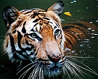
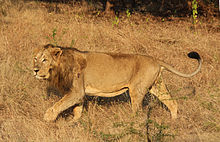
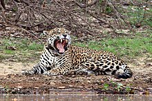

# Big Cats

* Zubair
* In Class Assignment 5
* January 31

___________________________________________________________________

The informal term "big cat" is typically used to refer to any of the four largest members of the entire Panthera genus. In descending order of their maximum potential size, these three species are: tigers, lions, and jaguars, with the tiger (Panthera tigris) being the largest.

Despite enormous differences in size, various species of cat are quite similar in both structure and behaviour. All cats are carnivores and efficient apex predators. Their range includes the Americas, Africa, Asia, and Europe.

## Tigers

The tiger (Panthera tigris) is the largest cat species, most recognizable for their pattern of dark vertical stripes on reddish-orange fur with a lighter underside. The species is classified in the genus Panthera with the lion, leopard, jaguar, and snow leopard. Tigers are apex predators, primarily preying on ungulates such as deer and bovids. They are territorial and generally solitary but social animals, often requiring large contiguous areas of habitat that support their prey requirements. This, coupled with the fact that they are indigenous to some of the more densely populated places on Earth, has caused significant conflicts with humans.

### Etymology

The word Panthera is probably of Oriental origin and retraceable to the Ancient Greek word panther, the Latin word panthera, the Old French word pantère, most likely meaning "the yellowish animal", or from pandarah meaning whitish-yellow. The derivation from Greek pan- ("all") and ther ("beast") may be folk etymology.

The word specific name tigris derives from the Classical Greek language τίγρις meaning "tiger" as well as the river Tigris.

### Subspecies

* Bengal Tiger
* Caspian Tiger
* Siberian Tiger
* Indochinese Tiger
* Malaysan Tiger

## Lions

The lion (Panthera leo) is a species in the family Felidae and a member of the genus Panthera. It has been listed as Vulnerable on the IUCN Red List since 1996, as populations in African range countries declined by about 43% since the early 1990s. Lion populations are untenable outside designated protected areas. Although the cause of the decline is not fully understood, habitat loss and conflicts with humans are the greatest causes of concern. The West African lion population is listed as Critically Endangered since 2016. The only lion population in Asia survives in and around India's Gir Forest National Park and is listed as Endangered since 1986.

### Etymology

The lion's name, similar in many Romance languages, is derived from the Latin leo,[14] and the Ancient Greek λέων (leon). The Hebrew word לָבִיא (lavi) may also be related.[16] It was one of the species originally described by Linnaeus, who gave it the name Felis leo, in his eighteenth-century work, Systema Naturae.

### Subspecies

* North African Lion
* Asiatic Lion
* West African Lion
* East African Lion

## Jaguars

The jaguar (Panthera onca), also known in South America as painted onça, is a wild cat species and the only extant member of the genus Panthera native to the Americas. The jaguar's present range extends from Southwestern United States and Mexico across much of Central America and south to Paraguay and northern Argentina. Though there are single cats now living within the western United States, the species has largely been extirpated from the United States since the early 20th century. It is listed as Near Threatened on the IUCN Red List; and its numbers are declining. Threats include loss and fragmentation of habitat.

### Etymology

The word 'jaguar' is thought to derive from the Tupian word yaguara, meaning "beast of prey". The word entered English presumably via the Amazonian trade language Tupinambá, via Portuguese jaguar. The specific word for jaguar is yaguareté, with the suffix -eté meaning "real" or "true".

The word 'panther' derives from classical Latin panthēra, itself from the ancient Greek pánthēr (πάνθηρ). The Greek pan- (πάν), meaning "all", and thēr (θήρ), meaning "prey" bears the meaning of "predator of all animals". Use of the word for a beast originated in antiquity in the Orient, probably from India to Persia to Greece.

### Subspecies

* Peruvian Jaguar
* Central American Jaguar
* Arizonian Jaguar
